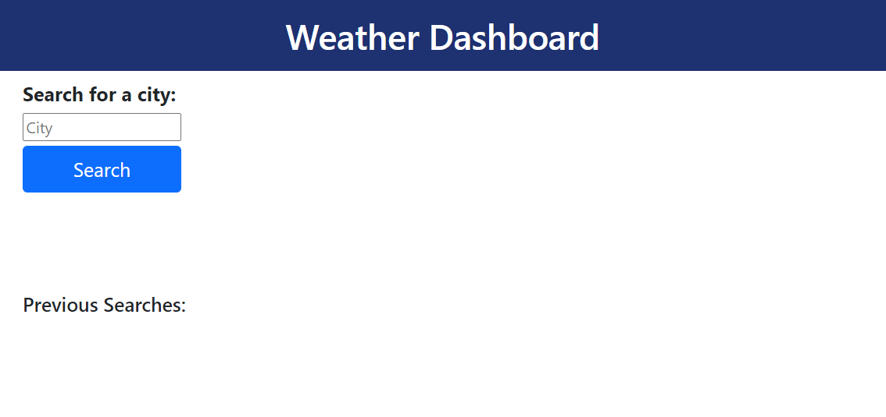
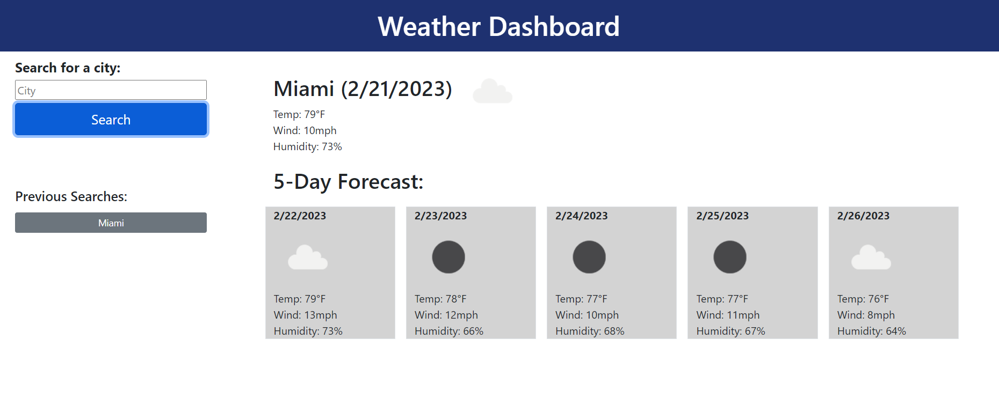
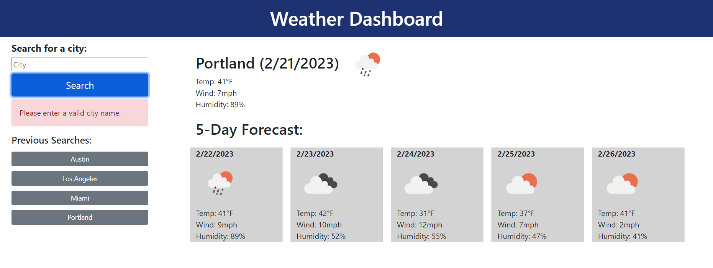

# weather-dashboard
A simple dashboard to retrieve current and 5-day forecast weather data for cities.

## User Story
AS A traveler  
I WANT to see the weather outlook for multiple cities  
SO THAT I can plan a trip accordingly

## Acceptance Criteria
GIVEN a weather dashboard with form inputs  
WHEN I search for a city  
THEN I am presented with current and future conditions for that city and that city is added to the search history  
WHEN I view current weather conditions for that city  
THEN I am presented with the city name, the date, an icon representation of weather conditions, the temperature, the humidity, and the the wind speed  
WHEN I view future weather conditions for that city  
THEN I am presented with a 5-day forecast that displays the date, an icon representation of weather conditions, the temperature, the wind speed, and the humidity  
WHEN I click on a city in the search history  
THEN I am again presented with current and future conditions for that city

## Description of Work Performed
Wrote HTML, JavaScript, and CSS files based on provided mockup:
* Utilized Bootstrap and CSS to apply styles to the page
* Used Open Weather API to query weather data and Day.js to format times
* Search bar allows user to input a city and return data from the API
* Current weather displays the city name, date, weather icon, temperature, wind, and humidity
* The 5-day forecast uses the same city name and displays the same weather data for the next five days
* Cities entered in the search bar are added to the previous searches list, which is sorted in alphabetical order
* Previous searches list is stored in local storage and persist upon page reload
* Previous searches can be clicked to query the API and returns the current and future weather
* If the search input field is blank or the API does not find a valid response, an error alert message will display

## Link to deployed GitHub page
[Deployed Challenge 6 Weather Dashboard Repo](https://abmetheny.github.io/weather-dashboard/)

## Screenshots

## License
This project is licensed under the MIT License - see the LICENSE.md file for details.